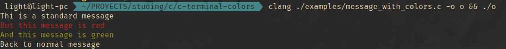

# c-terminal-colors
Colors definition for terminal output used in C/C++ terminal programs

## Example
```C
#include <stdio.h>
#include "../src/terminal-colors.h"

int main() {
  printf("Thi is a standard message\n"
      "%sBut this message is red\n"
      "%sAnd this message is green\n"
      "%sBack to normal message\n",
      TERMINAL_COLOR_RED,
      TERMINAL_COLOR_GREEN,
      TERMINAL_COLOR_RESET);
  return 0;
}
```

### Output


## License

Published under the MIT license, see
[LICENSE](./LICENSE).

